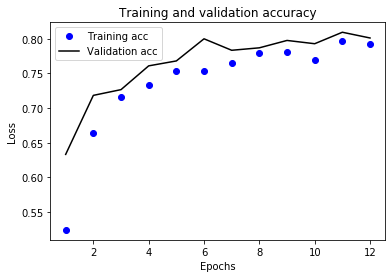

# Predicting pneumonia using CNN

Using a dataset from [Kaggle](https://www.kaggle.com/nih-chest-xrays/data), CNN predicts if the input chest x-ray image shows pneumonia and if it does, is it a bacterial or virus pneumonia.

## Accuracy plot through epochs

## Accuracy plot through epochs

### Dataset examples

No pneumonia

Bacterial pneumonia